  [
](LICENSE)


# Depths of the Mind: Experiência de Surto de Esquizofrenia

## Índice

1. [Sobre o Jogo](#sobre-o-jogo)  
2. [Objetivos](#objetivos)  
3. [Arte e Assets](#arte-e-assets)  
   - [Backgrounds](#backgrounds)  
   - [Personagem](#personagem)  
   - [Inimigos e Lixos](#inimigos-e-lixos)  
   - [Efeito Especial](#efeito-especial)  
4. [Instalação](#instalação)  
5. [Como Jogar](#como-jogar)  

---

## Sobre o Jogo

**Depths of the Mind** busca criar uma experiência imersiva, colocando o jogador no papel de uma pessoa que passa por um surto de esquizofrenia. A narrativa foca em explorar a perspectiva do protagonista e os desafios enfrentados durante o surto, além de oferecer opções de como lidar com a situação.

---

## Objetivos

- **Conscientização:** Mostrar os desafios de quem convive com a esquizofrenia e o impacto de traumas negligenciados.  
- **Informação:** Apresentar sintomas e comportamentos associados a um surto, de forma realista e empática.  
- **Empatia:** Estimular o entendimento das percepções alteradas, reforçando a importância do apoio e do tratamento.

---

## Arte e Assets

### Backgrounds

- **Cena Submersa Azul**, com atmosfera serena e vegetação marinha.  
  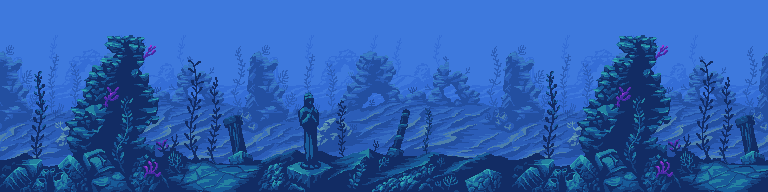

- **Cena Submersa Vermelha**, transmitindo tensão e desconforto nas cores.  
  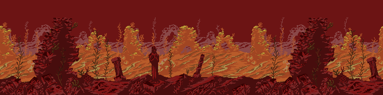

### Personagem

- **Mergulhador:** sprite animado em várias poses de nado, explorando a área subaquática.

  | Ação       | Imagem                                           |
  |:----------:|:-----------------------------------------------:|
  | **Idle**   | 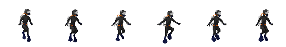           |
  | **Swimming** | 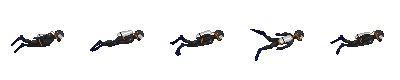 |
  | **Sprint** | 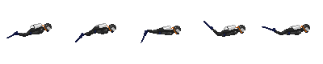       |
  | **Hit**    | 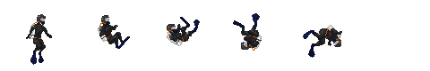             |

### Inimigos e Lixos

- **Peixes Normais e Hostis:** diferentes espécies com animações próprias para perseguir o jogador.

    | **Bom**                                         |     | **Hostil**                                         |
    |:-----------------------------------------------:|:---:|:-----------------------------------------------:|
    | 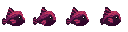 | **VS** | 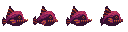 |
    | 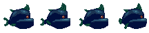 | **VS** | 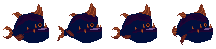 |
    | 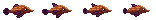 | **VS** | 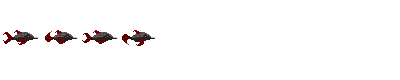 |

- **Objetos de Lixo:** garrafas, sacolas, detritos etc.

  | **Lixo 1** | **Lixo 2** | **Lixo 3** | **Lixo 4** | **Lixo 5** | **Lixo 6** | **Lixo 7** |
  |:---------:|:----------:|:----------:|:----------:|:----------:|:----------:|:----------:|
  | 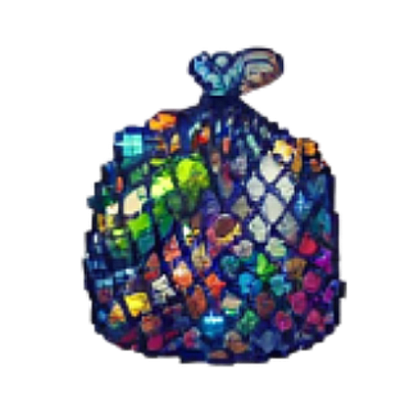 |  | 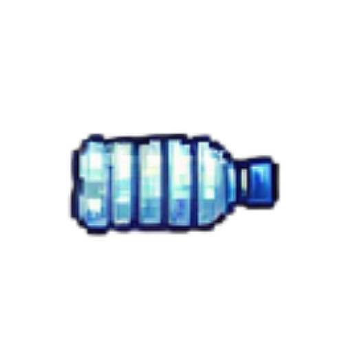 | 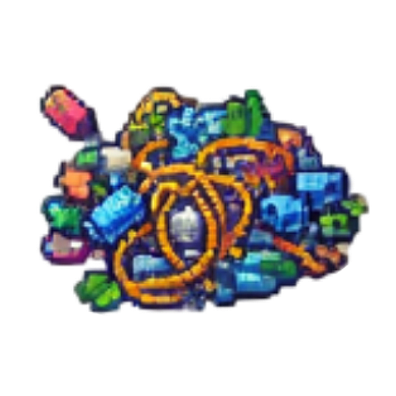 | 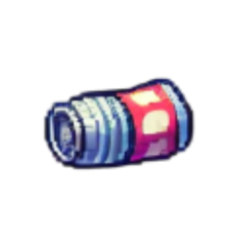 | 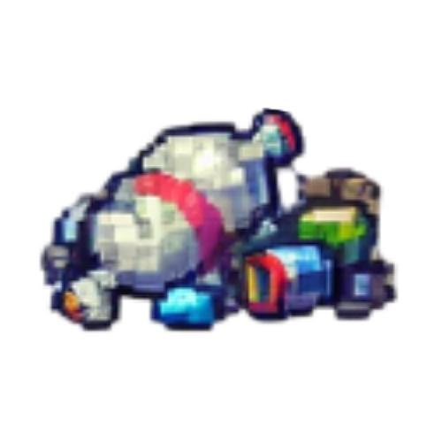 | 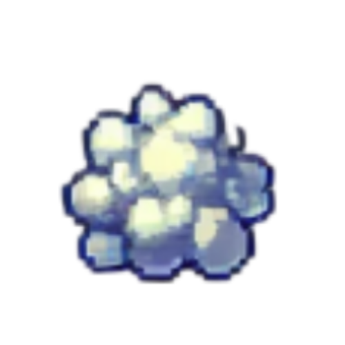 |

### Efeito Especial

- Efeito de transição entre os peixes bons e maus.

  | Transição                               |
  |:---------------------------------------:|
  |  |

---

## Instalação

Siga os passos abaixo para rodar o projeto localmente:

#### Clone o repositório  
```bash
git clone https://github.com/matheusnajal/Depths-of-the-Mind.git
```
#### Abra o projeto na Godot

- Instale a [Godot 4.3 ou Superior](https://godotengine.org/download).
- Execute o Godot Editor.
- Clique em `Importar Projeto`.
- Selecione a pasta do repositório clonado.
- Clique em `Abrir` e depois `Executar Projeto` (`F5`)

## Como Jogar

| Comando      | Ação        | Observações                                                   |
|:------------:|:-----------:|:--------------------------------------------------------------|
| `W`, `A`, `S`, `D`   | Movimentação| Permite andar em 8 direções (inclui diagonais)                |
| `Shift`        | Sprint      | Pressione junto com W/A/S/D para nadar mais rápido                       |
| `E`            | Interação   | • Aperte para comprar melhorias<br>• Segure para coletar lixo |
